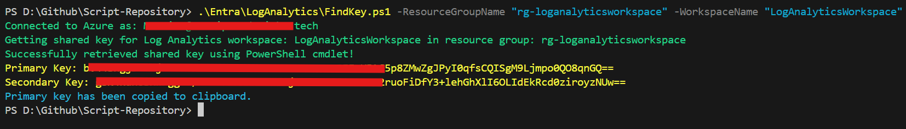

# Azure Log Analytics Key Retrieval Script

   

## Overview

PowerShell script to retrieve primary and secondary shared keys from Azure Log Analytics workspaces. Includes automatic module conflict resolution and clipboard integration for immediate use.

## Requirements

- PowerShell 5.1+ with Azure modules (`Az.OperationalInsights`, `Az.Accounts`, `Az.Profile`)
- Azure authentication (`Connect-AzAccount`)
- Log Analytics workspace access permissions

## Quick Start

```powershell
# Install required modules
Install-Module Az.OperationalInsights -Scope CurrentUser -Force

# Connect to Azure
Connect-AzAccount

# Run script
.\FindPrimaryAndSecondaryKey.ps1 -ResourceGroupName "your-rg" -WorkspaceName "your-workspace"
```

## Parameters

| Parameter | Description | Required |
|-----------|-------------|----------|
| `ResourceGroupName` | Azure Resource Group name | Yes |
| `WorkspaceName` | Log Analytics workspace name | Yes |
| `ForceModuleReload` | Force Azure module reload (troubleshooting) | No |

## Output Example



The script displays both primary and secondary keys and automatically copies the primary key to your clipboard.

## Troubleshooting

| Issue | Solution |
|-------|----------|
| Module conflicts | Use `-ForceModuleReload` parameter |
| Authentication error | Run `Connect-AzAccount` first |
| Resource not found | Verify resource group and workspace names |
| Permission denied | Check Log Analytics workspace permissions |

## Credits

**Author**: Mattias Melkersen  