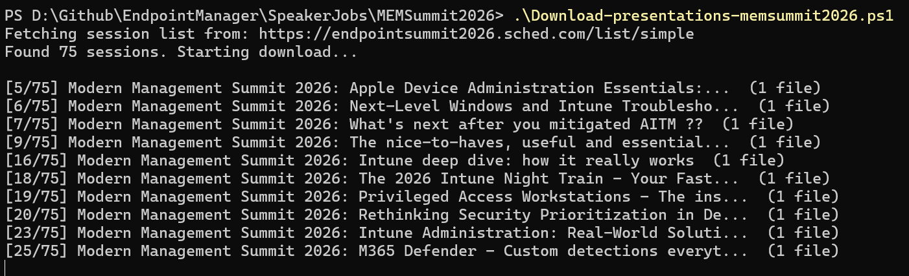

# MEM Summit 2026 Presentations

<p align="center">
  
</p>

Welcome to the collection of presentations from the Modern Management (Endpoint) Summit 2026. 

This repository contains an automated script to fetch publicly accessible presentation files (PDFs, PPTXs, etc.) directly from the Sched platform for the MEM Summit.

## Quick Start

To download or update the presentations, run the included PowerShell script:

```powershell
.\Download-presentations-memsummit2026.ps1
```

By default, the script skips re-downloading files that already exist in your local output directory (`.\MEMSummit2026-Presentations`) and bypasses sessions with no attached files (like social events or meals).

## Statistics

<!-- COUNT_START -->
**Current Presentation Count:** 117 sessions available
<!-- COUNT_END -->
